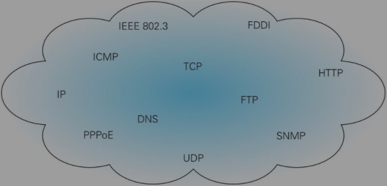
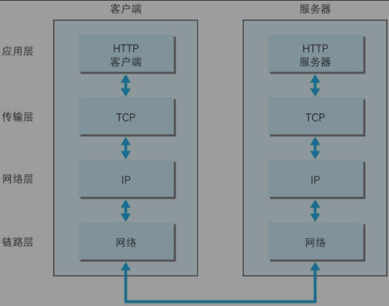
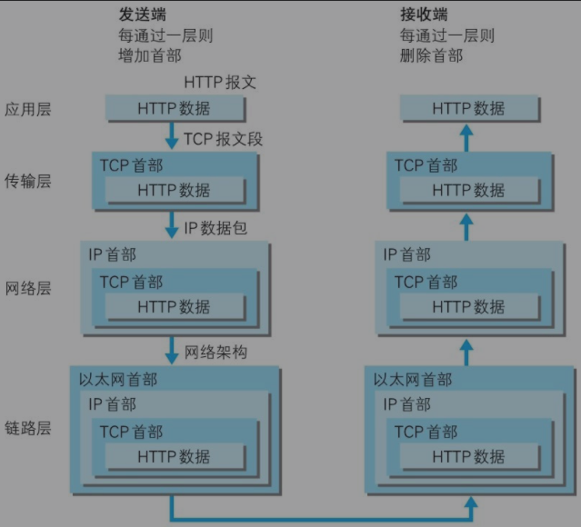
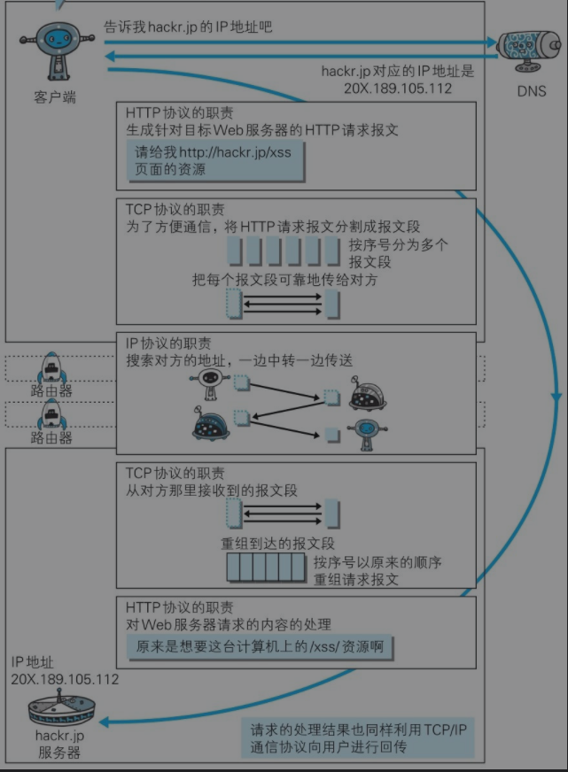
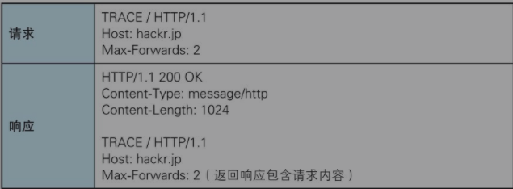
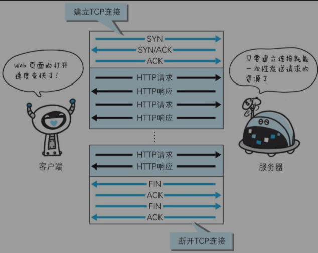
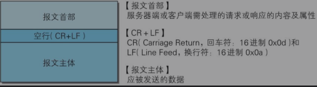
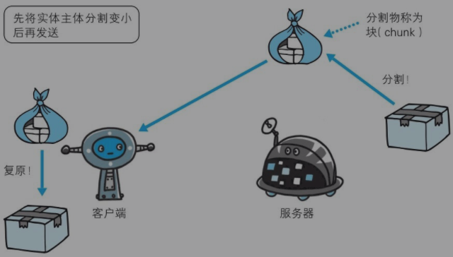

## 历史

0.9 HTTP 于 1990 年问世 但是那是起本没有正式的作为标准被建立

1.0 正好似座位表正式在 1996 年的 5 月 版本被命名为 HTTP/1.0 记载于 RFC1945

1.1 1997 年的 1 月是目前主流的 HTTP 协议版本

在了解 HTTP 之前是很有必要实现了解 TCP/IP 协议族的， HTTP 是在其基础上于运行的 HTTP 是疏忽它内部的一个子集

协议 不同的硬件和操作系统之间的通信 所有的一切都需要一种规则 而我们把这种规则称为协议



​ 图：TCP/IP 是互联网相关的各类协议族的总称

当然 网络上有多种说法 感兴趣的可以去了解下

## TCP/IP 的分层管理

分层是 TCPP/IP 协议足联和重要的一环

1. 应用层 决定向用户提供应用服务时通信的活动 包括 FTP DNS HTTP
2. 传输层 传输层对于上传应用层 提供处于网络连接中的两台计算机之间的数据传输 其中有两个性质不同的协议 TCP 和 UDP
3. 网络层 处理网络上流动的数据包 数据包是网络传输的最小单位 规定了通过怎么样的路劲 达到对方计算机 并且将把数据包传送给对方 简单地来说是 资源在 ton 过对台计算机或者网络设备 传输室 会选中一条传输路线
4. 数据链路层 用来处理连接网络的硬件部分 硬件上的范畴 均在链路层的作用范围

## TCP/IP 通信传输流

在进行真正的网络通行是啊 就是会根据上述的分层书序与对方进行通信 发送端从应用层往下走 接收层想应用层往上走



发送端在层层传输数据值那件 没经过一层时 必定会打个一个该层所述的首部信息 反之接收端在层层传递是没进过一层就会把对应的首部消去 我把数据信息包装做法就被称之为封装



## 透视 HTTP 的前置知识

1. IP 网际协议 位于网络层 这个名词可能挺起来有点跨装 但是是正式如此 几乎所有使用网络的系统都会用用到 IP 协议 TCP/IP 中的 IP 指的就是网际协议 你看名字 终究占一半
2. IP 协议的作用是把各种数据宝传送给对方 要确保确实传送到对方那里 就需要满足各类条件 其中两个重要的条件就是 IP 地址和 Mac 地址
3. IP 地址被指明了节点被分配到的地址 Mac 地址是指网卡所属的固定地址 IP 地址可以喝 Mac 地址进行配对 IP 地址可以变换 但是 MAC 地址基本就是不会变的
4. IP 地址的通信是依赖于 Mac 的地址的额在网络上 通信双方在同一局域网的情况是非常少见的，通常是进过多态计算机和网络设备中转才能到达对方目的地 在进行钟转时 会利用下一站的中专设具备的 MAC 地址来下一个目标地址 这时会采用 ARP 协议 这是一种用来解析地址的协议 通常就是根据通信方的 IP 地址就可以反查出对应的 MAC 地址

### 无法全面掌握互联网中的传输状况

网络设备只能粗略的获悉传输路线

### 确保可靠型的 TCP 协议

1. 按层次分 TCP 属于传输层 提供可靠的字节流服务
2. 所谓的字节流 阢 是指方便传输 八大块的数据分割层报文段 segment 未带哪位的数据包进行管理 而可靠的传输服务是指能够把数据准确可靠的传给对方 简单地说就是 为了更加容易传送大数据 才把数据分割 而且能够却热恩数据最终是否哦送到到对方
3. 为了确保准确无物的将数据送到目标 TCP 协议采用的三次握手策略 利用 TCP 协议把数据包发送出去后 TCP 不会对传送后的情况置之不理 他一定会向对方确认确认是否成功送到 握手过程中使用了 TCP 的标志 flag SYN 和 ACK
4. 发送端首先会发送一个带 SYN 标志的额数据报给对方 就饿手段后带回后回传一个 SYN/ACK 的标志的数据包拉表示确认信息 最后发送端会再回传一个带 A 出口标志的数据包代表握手结束
5. 如果中途有米各阶段终端 协议会再次以相同的顺序发送相同的数据包

## 负责域名解析的额 DNS 服务

1. domain name system 服务是和 HTTP 协议一样位于应用层的协议 他提供域名和 IP 地址之间的解析服务 计算机即可以被服务于 IP 地址 亦可以被赋予主机名和域名
2. 用户通常使用主机名和域名来访问计算机 而不是直接通过 IP 地址访问 因为 IP 的孩子是一组纯数字 人类更加习惯的去记忆用字母配合数字的命名的东西 但是计算机却更加擅长处理纯数字
3. 为了解决上述的问题 DNS 服务就因运而生 DNS 协议通过域名查找对应的 IP 地址 或者从 IP 地址反查域名的服务。

## 完整的请求



## URI 和 URL

相比较统一资源标识符 URI 我们更加的熟悉 URL 统一资源定位符 他就是我们使用浏览器等客户端访问 web 页面是所需要输入的网页地址

### 统一资源定位符 uniformresource Identifier

1. uniform 规定了统一的格式 可以方便出

## 简单的 HTTP 协议

### HTTP 协议用于客户端和服务端之间的通信

1. HTTP 协议和 TCP/IP 协议组内的其他众多协议相同 使用与客户端和服务端之间的通信
2. 请求访问文本或则图像影音等资源的一段被称作客户端 而提供资源响应的一段被称作服务端 应用 HTTP 协议的时候 可定时一段担任客户端角色 另一端担任服务端角色
3. HTTP 协议能够明确区分那段时客户端，哪段时服务端

### 通过请求和响应的交换达成通信

1. 客户端若果未建立通信，服务端是不会再没有请求之前发送相应的

### HTTP 是不保存状态的协议

1. HTTP 是一种无状态的协议 HTTP 协议本身不对请求和响应之间的通信状态进行保存 也就是在这个，协议对发送过的请求或者响应上都是还不做持久化的处理的。

   

2. 这是为了跟快的处理大量的事务，确保协议的可伸缩性，特意的吧 HTTP 协议设计成如此简单地，但是随着 web 的不断发展，因无状态的而导致业务处理变得棘手的情况增多了，比如，用户登录到一家购物网站 即使他跳转到该站的其他页面后 也应该继续保持登录状态 ，那么网站就需要保存用户的状态

3. HTTP/1.1 为了实现期望的保持状态的功能 就引入了 cookie 技术

### 请求 URI 定位资源

1. HTTP 协议使用 URI 定位到互联网上的资源
2. 当客户端请求访问资源的而发送请求时 需要在请求的报文中加入亲需要的 URI 指定请求瑞的方式有很多 URI 完整的请求 URI 在手部字段 host 中写明网络域名或者 IP 地址 初次紫外 当访问的不是特定的资源而是对服务器本身发起的氢气 u 可以用一个 \* 来代替请求的 URI

```
OPTIONS * HTTP/1.1
```

### 告知服务器意图的 HTTP 方法

1. GET 获取资源

   1. GET 方法用来请求访问已被 URI 识别的资源。指定的资源经过服务端解析后返回响应内容 如果请求的资源是文本 那就保持原样返回 如果像是 CGI 那样的程序，则返回经过执行后的额输出结果

2. POST 传输实体主体

3. 虽然 GET 方法也可以传输主体 但是一般不用 GET 方法进行传输

4. PUT 传输文件

   1. PUT 方法用来传输文件 就想 FTP 协议的文件上传一样 要求在请求报文中包含文件内容 然后保存到请求的 URI 的指定位置
   2. 但是考虑到 PUT 方法自身不带验证机制 任何人都可以上传文件 存在安全性的问题 大部分的网站不使用该网站方法 一般配合 web 应用程序的验证机制 或者架构设计采用 REST（表征状态转移）标准的同类 web 网站 才会开放使用 PUT 方法

5. HEAD 获取报文首部

   1. 与 GET 方法几乎是一样的 只是不返回报文主题的部分 用于确认 URI 的有效性以及资源更新的日期时间的

6. DELETE 删除文件

   1. DELETE 方法与 PUT 方法相反 是来删除文件的
   2. 但是它和 PUT 一样存在安全隐患 一般的网站也不会开放

7. OPTIONS 询问支持的方法

   1. 用来查询针对请求 URI 指定的资源支持的方法

8. TRACE 追踪路径

   1. TRACE 方法是让 web 服务端将之前的请求通信环会给客户端的方法
   2. 发送请求时 要在 headers 中的 Max-Forwards 首部字段填入数值，每经过一个服务端就将该数字减一，当数字刚好见到 0 的时候，即停止传输，最后接收到请求的服务器段返回状态码 200 ok 的响应。
   3. 客户端可以通过 TRACE 方法来查询到发出的请求是怎么样加工修改/篡改的。这是因为，请求想要连接殴打原目标服务器可能通过代理中转，trace 方法就是用来确认连接诶过程发生这一系类的操作的。
   4. 注意：TRACE 很少使用的 而且其非常容易引起 XST 跨站追踪 就更加少被使用到了。

8) CONNECT 要求使用隧道协议连接代理

   1. 要求在与代理服务器通信时建立隧道，实现用隧道协议进行 TCP 通过 TCP 通信。重要使用的是 SSL 和 TSL 协议把同性内容加密后经网络隧道传输

### 注意点

1. 方法的作用是可以只能怪请求按期望产生某种行为
2. 方法名是区分大小写的

### 持久连接节省通信量

HTTP 协议的初始版本中 每进行一次 HTTP 通信都要断开一次 TCP 连接

以当年的通信情况来看 䧵都是熔炼更小的文本传输 所以即使这样也没有多大的问题 可随着 HTTP 的普及 文档中的内容把含大量图片的情况多了起来。

比如使用浏览器访问一个包含许多张图片的 HTML 页面时 在发送请求访问 HTML 页面资源的同时 也会请求改 HTML 页面的其他资源 一次会造成武威的 TCP 连接和断开 增加填写量的开销

1. 持久连接

   > ​ 为了解决 TCP 连接的问题 HTTP/1.1 和一部分 HTTP/1.0 想出了持久连接的的方法（HTTP Persistent Connections 也被称为 HTTP keep-live 或者 HTTP connection reuse）
   >
   > 特点就是 只要任意一端没有明确提出断开连接 则一直保持 TCP 连接状态



> 持久连接的的好处在于减少了 TCP 连接的重复建立和的断开造成的额外开销，减轻了服务端的负载。
>
> 另外减少的开销那部分时间 使用 HTTP 请求和响应 使 HTTP 请求和响应能够更早的结束 这样 web 页面的显示熟读就相应挺高了。

在 HTTP/1.1 中，所有的连接默认都是持久连接 HTTP/1.0 内并非所有都标准化

### 管线化

持久连接是的多数请求以管线阿虎的方式发送成为可能 从前发送请求后需要等到并受到响应 才能发送下一个请求 管线化技术出现后 就不用刻意等待 就可以直接发送下一个请求

这样就能够做到同时并行发送多个请求 而不是一个接一个的等待响应

滚鲜花技术比持久化连接还要快 请求数越多，时间就越明显

### 使用 cookie 的状态管理

HTTP 是无状态协议的 他不对之前发送过的请求和响应的状态 进行管理 也就是说无法根据之前的状态 进行本次的请求处理。假设要求登录认证的 web 页面本身无法进行进行状态的管理 那么每次缇欧专心的页面就需要再次登录 或则要求在每次请求的报文中附加参数来管理状态

> 无状态的优点 由于不必要保存状态 自然就减少了服务器的 CPU 以及内存资源的消耗 也正是因为 HTTP 协议本身的简单性 才会被应用在各种场景。

于是就引入了 cookie 技术。

1. cookie 技术通过在请求和响应报文中写入 cookie 信息来控制客户端的状态
2. cookie 胡更具从服务器发送的响应报文内的一个 Set-Cookie 的首部字段信息，通知客户端保存 Cookie。当下一次客户端再次往该服务器端发送请求是客户端会自动在请求报文中加入 Cookie 值后发送出去。
3. 服务端会发现客户端发送或来的 Cookie 后 去检查究竟是那一个客户端发来的连接请求 然后对比服务器上的记录 最后等到之前的状态信息

## HTTP 报文内的 HTTP 信息

### HTTP 报文

> 用于 HTTP 协议交互信息被称作 HTTP 报文 。

1. 请求端的 HTTP 报文被称作请求报文
2. 响应端的 HTTP 报文被称作响应报文
3. HTTP 报文是由多行（CR + LF 做换行符）数据构成的字符串文本
4. HTTP 报文划分成报文首部和报文主体 注意并不应定要有报文主体

### 报文的结构

1. 请求行 包含于请求的方法 请求的 URI 和 HTTP 版本
2. 状态行 包含表明响应结果的状态码 原因短语和 HTTP 版本
3. 首部字段 包含表示请求和响应的各种条件和属性的各类首部 一般就有四种首部 分别是通用首部 请求首部响应首部 和实体首部
4. 其他可能包含 HTTP 的 RFC 里未定义的首部

### 编码提升传输速率

HTTP 在传输数据时可以按照数据的原貌直接传输 但是也可以在传输过程中通过编码替身传输速率 通过在传输时编码 能够有效的处理大量访问请求 但是编码的操作需要计算机来完成 因此会消耗更多的 CPU 等资源。

1. 报文主体和实体主体
   1. 报文 message 是 HTTP 通信中基单位 有 8 位字节流 比特 通过 HTTP 通信
   2. 实体 entity 作为请求或者响应的有效载荷数据 被传输 其内容有实体首部和实体主体组成

HTTP 报文的主体用于传输请求或者响应的实体主体

TODO: 理解报文和实体的区别

2. 压缩传输的内容编码

   1. 内容编码指明应用在实体内容上的编码格式，并保持实体信息原样压缩。内容编码后的实体由客户端接收并负责解码。
      1. gzip GNU zip
      2. compress Unix 系统的标准压缩
      3. deflate zlib
      4. Identity 不进行分割

3. 分割发送的分块传输编码

   1. 在 HTTP 通信过程中，请求的编码实体资源尚未全部传输完成之前，浏览器是无法显示请求月面的额在纯属大容量数据是 通过把数据分成多块 能够让浏览器数据分割成多块 能够让浏览器逐步显示页面。
   2. 分割传输编码会将实体主体分成多个部分 每一块都会用十六进制来标记快的大小 而实体主体的最后一块会使用“0（CR + LF）”来标记
   3. HTTP/1.1 中存在一种被称作为传输编码的机制 他可以在通信是按照莫衷编码方法传输 但只定义作用分块传输编码中

   ### 发送多种数据的多部分对象集合

   > MIME 多用途因特网邮件拓展 它允许邮件处理文本 图片 视频等多个类型不同的数据
