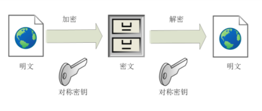

# HTTPS

## 1. 解释

### 	1.1 HTTPS 重点就是分析这个 "S" ,它代表什么呢?

> TSL(传输层安全) SSL(安全套接层) 是一种为网络通信提供安全和数据完整性的一种安全协议。 
>
> TLS/SSL 处于HTTP和TCP之间。

### 1.2 介绍

HTTPS  安全超文本转移协议 

HTTPS是以安全为目的HTTP通道。简单地说就是HTTP的安全版

##2. SSL协议提供的额安全通道有以下三个特性

### 2.1	机密性 使用密钥加密数据 HTTP协议传输的时候是明文的

​	2.1.1 对数据保密 只能有可信的人访问 对于其他不相关的人是不可见的 

	>实现机密性的手段就是通过 加密  使用某种方式将信息转化成谁都无法看不懂的乱码 只有拥有特殊钥匙的人 才能转换出原始的文本
	>
	>所有的加密算法都是公开 任何对其感兴趣的人都可去研究它他 只不过**密钥**必须保密

密钥： 本质上密钥就是一长串的数字 度量单位是 bit 
按照密钥使用方式 可以分为 对称加密和非对称加密

#### 对称加密

1. 指的就是加密和解密使用的密钥都用的是同一个 ,只要保证米哟啊的安全 整个通信过程就可以说是具有了机密性

   

2. TLS提供了许多对称加密的算法 不过最常用的还是AES 高级加密标准

   1. 密钥的长度可以是 128 192 256 安全轻度搞性能也好 而且有的硬件设备还会做特殊的额优化
   2. 对称加密算法存在一个 **分组模式**的概念 他可以使得固定长度的密钥加任意长度的明文 把密钥转化成密文
   3. 对称加密看上去实现可机密性 但是其中区存在一个很大的问题 那就是如何把密钥安全的传递给对方呢 如何安全的交换 密钥交换
   4. 如果密钥在传递过程被黑客窃取了 那他就可以随意解码收发的数据 于是就有了 非对称加密 公钥加密算法
   5. 他又两个密钥 一个叫公钥 一个叫私钥 公钥是可以公开是任何人使用的 而私钥必须严格保密
   6. 他们之间存在 很特别的关系 公钥加密后只能用四要解密 反过来也同理。非对称加密 解决了密钥交换的问题 网站都会报关私钥 网站可以分发人一共要 想要登入网站只需要你用公钥加密就行 但是密文只能有私密持有者才能解密 黑客没有私钥 就无法解密密文了。
   7. 非对称加密 要比对称加密难的多 其中RSA是TLS中最为著名的 他的安全性是基于 整数分解的数学难题 使用了两个超大的质数的成绩作为生成密钥的次材料 逍遥从公钥推算出私钥几乎是不可能的。
   8. 还有一个名叫ECC的非对称加密 以及与椭圆曲线离散对数的数学难题 
   9. 听到这里 你一定认为 我们是不是可以抛弃对称加密 只用非对称加密呢 必然不是 虽然他解决了密钥交换的问题 但是由于他们的底层都是基于复杂的数学难题 运算速度很慢 仅仅只是用非对称加密 确实解决了安全上的问题但是在通行速度上就慢的如乌龟 实用性几乎为0
   10. 那怎么办 当然会有人想到 是否能够混合两者加密 取长补短 技能搞笑的加密解密 又能安全的密钥交换 就是现在最常用的混合加密方式 简单理解就是 在同刚开始是使用非对称加密 RSA 首先去解决米快要交换的问题
   11. 之后使用随机数产生对称算法使用的 会话密钥 再用公钥加密 由于会话密钥很短 16或者32字节 慢点可以接受 对方拿到米问候用私钥解密 去除会话密钥 之后就无须在使用非对称加密 全都是用对称加密 这样就完美实现了机密性
   12. 公钥加密私钥解密 私钥签名公钥验签

###  2.2	可靠性 服务器和客户的认证都会被认证 客户的认证是可选的

​	2.2.1 

###2.3	完整性 会对传输的数据进行完整性的检测

​	2.3.1 是指数据在传输过程中没有备足暗改 完整的保持原状 机密性虽然可以让数据变得秘密 但是不能防止不法分子 何可对数据的串改 他们可以器哦啊桥的调整数据的数据 或则增加 删除数据 破坏通信过程

## 3. 解决的痛点

HTTP协议存在明文和不安全的缺点是靠自己无法解决的 所以就需要新引入HTTPS协议

HTTP 在传输工程中处于透明公开的状态 任何人都可以在链路中接货、修改或者伪造请求响应报文 数据不具有可行性。

比如说像为网上购物 网银 交易相关的需要高安全和高信任度的场景是非常致命的 如果没有一系类的安全保障 在互联网上进行各种电子商务交易

不止这些对安全性要求高的网站 就像一些视频网站 新闻网站 可能也会遭到流量劫持 在页面中强行嵌入广告 分流用户 导致各种意义上的利益损失。

对于想你我这样的普通网民 HTTP不安全的隐患就更加大了 上网的记录会被轻易地劫持 你也无法分辨网站的真实性 不法分子可以为张英航玩玩站 盗取你的账号密码银行卡号等敏感信息 威胁人身和财产安全

## TSL1.2连接过程解析

>假设你已经了解了 对称加密和非对称加密 数字签名和证书等密码学的相关知识

1. HTTPS建立连接 

   1. 当你在浏览器地址栏输入HTTPS开头的URI时 浏览器首先要从URI解析出他的协议名 和域名 HTTPS的默认端口为443 他在用DNS解析域名 得到目标的IP地址 然后就可使用三次握手与网站建立TCP连接了
   2. 在HTTP协议 建立连接后 浏览器会立即发送请求报文 但是在HTTPS协议中他需要再用另一个握手 过程 在TCP上建立安全连接 止呕胡才是收发HTTP报文
   3. 这个握手过程和停车票有些类似 是HTTPS和TLS协议中最重要的额最核心的部分

2. TLS协议的组成 由不同的职责的模块组成 

   1. 记录协议 规定了TLS协议收发数据的基本单位 他有点像是TCP中的segment 所有的其他子协议都需要通过记录协议发出

   2. 警报协议 向对方发出警报信息 有点像HTTP协议中状态码 比如 protocol_version就是代表不支持旧版本 bad_certificate 就是证书有问题 收到警报后 另一方 可以选择据需 也可以选择终止连接

   3. 握手协议 最复杂的子协议 要比TCP的SYN/ACK复杂的多 浏览器和服务器 会在握手过程中协商TLS版本号 随机数 密码套件等信息 然后交换证书和密钥参数 最终双方协商得到会话密钥 用于后续的混合加密

   4. 变更密码协议 非常简单 就是一个通知 告诉对方 后续的数据豆浆使用加密保护 

      下图的这张图简要的描述 TLS的握手过程 其中每一个框都是一个记录

      

      

      

      